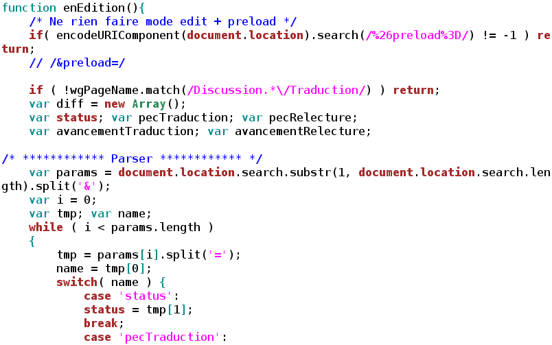

 
# 📄 Introduction

## Definition

???+note "Short definition"
    A programming language is a conventional notation for formulating algorithms and producing computer programs that apply them.

---

???tldr "long definition"

    A **[programming](https://fr.wikipedia.org/wiki/Programmation_informatique)** language is a conventional notation for formulating [algorithms](https://fr.wikipedia.org/wiki/Algorithme) and produce [computer programs](https://fr.wikipedia.org/wiki/Programme_informatique) that apply them. In a way similar to a natural language, a programming language is composed of an [alphabet](https://fr.wikipedia.org/wiki/Alphabet), a [vocabulary](https://fr.wikipedia.org/wiki/Vocabulaire), [grammar](https://fr.wikipedia.org/wiki/Grammaire), [meanings](https://fr.wikipedia.org/wiki/Sens_(linguistics)), but also a [translation environment](https://fr.wikipedia.org/wiki/Environnement_(computer science)) supposed to make its [syntax](https://fr.wikipedia.org/wiki/Syntaxe) understandable by the machine.

    Programming languages allow to describe on the one hand the structures of the data that will be manipulated by the computer apparatus, and on the other hand to indicate how the manipulations are carried out, according to which algorithms. They serve as a means of communication by which the programmer communicates with the computer, but also with other programmers; programs are usually written, read, understood and modified by a team of programmers.

    A programming language is implemented by an automatic translator: [compiler](https://fr.wikipedia.org/wiki/Compilateur) or [interpreter](https://fr.wikipedia.org/wiki/Interpr%C3%A8te_(computer)). A compiler is a computer program that first transforms a [source code](https://fr.wikipedia.org/wiki/Code_source) written in a given programming language into a target code that can be directly executed by a computer, i.e. a program in [machine language](https://fr.wikipedia.org/wiki/Langage_machine) or in [intermediate code](https://fr.wikipedia.org/wiki/Bytecode), while the interpreter performs this translation "on the fly".

    Programming languages offer different possibilities of [abstraction](https://fr.wikipedia.org/wiki/Abstraction_(philosophy)) and a notation close to [algebra](https://fr.wikipedia.org/wiki/Alg%C3%A8bre_g%C3%A9n%C3%A9rale), allowing to describe in a concise and easy to grasp way the operations of data manipulation and the evolution of the program flow according to the situations. The possibility of abstract writing frees the programmer's mind from superfluous work, especially taking into account the specificities of the computer hardware, and thus allows him to concentrate on more advanced problems.

    | Image | Description |
    |:--:|:--:|
    || Example of JavaScript program |
    |Source | [Wikipedia](https://fr.wikipedia.org/wiki/Langage_de_programmation#/media/Fichier:Source_code_in_Javascript.png)|

__*source: Wikipedia[^wiki1]*__
[^wiki1]: [Wikipedia : Definition](https://fr.wikipedia.org/wiki/Langage_de_programmation#D%C3%A9finition)

## Applications of programming 

> A programming language provides a framework for developing algorithms and expressing flow diagrams. It allows in particular to describe the data structures that will be manipulated by the computer and what the manipulations will be. A programming language serves as a means of communication with the computer but also between programmers: programs are usually written, read and modified by a team of programmers.

__*source: Wikipedia[^wiki2]*__
[^wiki2]: [Wikipedia: Use](https://fr.wikipedia.org/wiki/Langage_de_programmation#Utilisation)

---

???+info "Examples"
    === "A chess Game (French)"
        

        These 2 people launched the project to make a chess game in JavaScript in 1 week.

    === "Snake (English)"
        

        This person challenged himself to make a Snake game in 5 minutes using Python

## Prerequisites

### An editor

???+note "Defintion"
    A [source code editor](https://fr.wikipedia.org/wiki/%C3%89diteur_de_code_source) is a text editing program specifically designed for **editing the source code of a computer program**. It can be a stand-alone application or integrated with an integrated development environment (IDE) or a web browser. A source code editor is a fundamental programming tool, because the fundamental job of programmers is to write and modify source code.

#### VsCodium

> [VsCodium](https://vscodium.com/) is the free and open source version of [Visual Studio Code](https://code.visualstudio.com/)

|Software|Image|Github repository|Contributors|
|:----:|:----:|:----:|:----:|
| [VsCodium](https://vscodium.com/) | { width=100 } | [Github](https://github.com/VSCodium/vscodium) | [Contributeurs](https://github.com/VSCodium/vscodium/graphs/contributors) |

!!!savoir "Tutorial"
     ^^For more details about VSCodium, go to the excellent site of [Mr. Chambon](https://lyc-84-bollene.gitlab.io/chambon/) about it[^tuto1]^^
    [^tuto1]: [Choose an editor: Mr.Chambon](https://lyc-84-bollene.gitlab.io/chambon/2-%C3%89diteurs/0-index/)

## Program

### What we are going to see 

!!!note "Languages"
    In this site made entirely in Markdown with the Mkdocs[^mkdocs] tool, we will see some examples of programming languages as well as their use and utility.
    So we will see:
    [^mkdocs]: [Mkdocs](https://www.mkdocs.org/)

    1. [🐍 Python](python.en.md){ .md-button }
    2. [💻 lua](lua.en.md){ .md-button }

### Additional info

!!!note "Additional information"
    Here you will be able to see what changes have been made to the site in detail as well as the method of putting the site online

    1. [⚙️ Putting it online](mise_en_ligne.en.md){ .md-button }
    2. [🔨 Changes](modifications.en.md){ .md-button }

### Comments

!!!note "Commentaires"
    You can finally leave a comment about my site

    1. [💬 Comments](commentaires.en.md){ .md-button }

